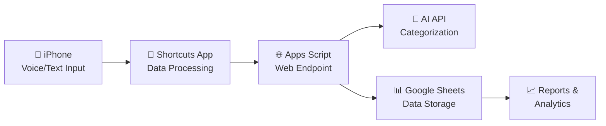

# 📱 One-Click Accounting

一个利用 Apple iPhone Shortcuts、Google Sheets Apps Script 和 AI API 实现一键记账的智能系统。

> A smart expense tracking system using Apple iPhone Shortcuts, Google Sheets Apps Script, and AI API for one-click accounting.

## ✨ Features

- **🗣️ Voice Input**: "Hey Siri, log my expense" - speak your expenses
- **🤖 AI Categorization**: Automatically categorizes expenses using AI
- **📊 Google Sheets Integration**: All data stored in your personal Google Sheet
- **📍 Location Detection**: Automatically captures where you spend money  
- **⚡ One-Click Logging**: Record expenses in under 10 seconds
- **📈 Smart Reporting**: Monthly summaries and spending analysis
- **🔒 Privacy-First**: Your data stays in your Google account

## 🚀 Quick Start

### What You'll Need (All Free!)
- iPhone with Shortcuts app
- Google account
- AI API key (OpenAI/Anthropic/Gemini - ~$0.01-0.25/month)

### 5-Minute Setup
1. **Deploy Google Apps Script** from `/apps-script/Code.gs`
2. **Create iPhone Shortcut** following `/shortcuts/SETUP_GUIDE.md`  
3. **Say "Hey Siri, log my expense"** and start tracking!

📖 **[Complete Setup Guide](docs/SETUP_GUIDE.md)** - Detailed step-by-step instructions

## 🎯 How It Works



1. **Speak or type** expense details into your iPhone
2. **Shortcuts app** captures amount, description, location, payment method
3. **Apps Script** receives data and calls AI for smart categorization  
4. **Google Sheets** stores the organized expense data
5. **View reports** and spending insights in your spreadsheet

## 📂 Project Structure

```
├── apps-script/           # Google Apps Script backend
│   ├── Code.gs           # Main server-side logic
│   └── appsscript.json   # Apps Script configuration
├── shortcuts/            # iPhone Shortcuts configuration  
│   ├── OneClickAccounting.json    # Shortcut definition
│   └── SETUP_GUIDE.md             # Detailed setup steps
├── config/               # Configuration templates
│   ├── config.template.json       # Settings template
│   └── .env.template              # Environment variables
├── docs/                 # Documentation
│   └── SETUP_GUIDE.md    # Complete setup guide
└── README.md            # This file
```

## 🏃 Usage Examples

### Voice Input
- **"Hey Siri, log my expense"**
- Speak: *"Lunch at McDonald's"*
- Amount: *"$12.50"*  
- Payment: *"Credit Card"*
- ✅ Done! Categorized as "Food & Dining"

### Quick Scenarios
- ☕ **Coffee Run**: "Coffee at Starbucks, $5.50"
- 🚗 **Gas Fill-up**: "Gas station, $45.00"  
- 🛒 **Grocery Shopping**: "Whole Foods groceries, $67.23"
- 🎬 **Entertainment**: "Movie tickets, $24.00"

## 🧠 AI Categorization

The system automatically categorizes expenses into:

| Category | Examples |
|----------|----------|
| 🍽️ **Food & Dining** | Restaurants, coffee, groceries |
| 🚗 **Transportation** | Gas, parking, rideshare, public transit |
| 🛍️ **Shopping** | Clothing, electronics, household items |
| 🎭 **Entertainment** | Movies, games, hobbies |
| 💡 **Bills & Utilities** | Phone, internet, electricity |
| 🏥 **Healthcare** | Doctor visits, prescriptions, pharmacy |
| ✈️ **Travel** | Hotels, flights, vacation expenses |
| 📚 **Education** | Books, courses, training |
| ❓ **Other** | Miscellaneous expenses |

## 💰 Cost Breakdown

### Setup Cost: **FREE**
- Google Sheets: Free
- Apps Script: Free  
- iPhone Shortcuts: Free (built-in iOS app)

### Monthly Usage: **~$0.01 - $0.25**
- **Light usage** (100 expenses): ~$0.01
- **Heavy usage** (1000 expenses): ~$0.25
- AI API costs only (OpenAI GPT-3.5 cheapest)

### Return on Investment: **Priceless**
- 📊 Better spending awareness
- ⏰ Time saved on manual entry
- 💡 Insights for budgeting
- 📈 Financial goal tracking

## 🛡️ Privacy & Security

- ✅ **Your data stays with you** - stored in your personal Google Sheet
- ✅ **No financial accounts accessed** - manual expense entry only  
- ✅ **AI sees description only** - for categorization purposes
- ✅ **Location optional** - can be disabled in settings
- ✅ **Open source** - review all code yourself

## 🔧 Customization

### Custom Categories
Edit the AI prompt in `Code.gs` to use your own spending categories.

### Different AI Providers
- **OpenAI GPT-3.5/4** - Most accurate, low cost
- **Anthropic Claude** - Privacy-focused, good accuracy  
- **Google Gemini** - Free tier available
- **Local AI** - For complete privacy (advanced setup)

### Multiple Currencies
Update the `CONFIG` section for your local currency format.

## 📊 Sample Reports

The system automatically generates insights like:

### Monthly Summary
```
November 2024 Spending Report
💰 Total: $1,247.83 (43 transactions)

📊 By Category:
🍽️ Food & Dining: $456.32 (37%)
🚗 Transportation: $234.15 (19%) 
🛍️ Shopping: $187.90 (15%)
🎭 Entertainment: $142.67 (11%)
💡 Bills & Utilities: $226.79 (18%)
```

### Trends & Insights
- 📈 Spending patterns by day/week/month
- 🏆 Top merchants and categories
- 📍 Location-based spending analysis
- 💳 Payment method preferences

## 🚨 Troubleshooting

### Common Issues
| Problem | Solution |
|---------|----------|
| Shortcut fails | Check internet connection, verify Apps Script URL |
| No AI categorization | Confirm API key is valid and has quota |
| Data not appearing | Check Apps Script permissions and execution logs |
| Wrong categories | Customize the AI prompt for your needs |

### Getting Help  
1. 📖 Check the [Setup Guide](docs/SETUP_GUIDE.md)
2. 🔍 Review Apps Script execution logs
3. 🐛 Create a GitHub issue
4. 💬 Ask questions in Discussions

## 🗺️ Roadmap

### Coming Soon
- [ ] 📱 Apple Watch complications
- [ ] 📈 Advanced analytics dashboard  
- [ ] 🔄 Automatic recurring expense detection
- [ ] 📤 Export to popular budgeting apps
- [ ] 🌍 Multi-language support
- [ ] 📷 Receipt photo capture & OCR

### Future Ideas
- [ ] 🏦 Bank transaction import (read-only)
- [ ] 🤝 Shared family/team accounts
- [ ] 🎯 Budget goals and alerts
- [ ] 📊 Custom dashboard creation
- [ ] 🔔 Spending limit notifications

## 🤝 Contributing

We welcome contributions! Here's how you can help:

1. 🐛 **Report bugs** - Create detailed issue reports
2. 💡 **Suggest features** - Share your ideas in Discussions  
3. 📝 **Improve docs** - Fix typos, add examples
4. 🔧 **Submit code** - Bug fixes, new features, optimizations
5. ⭐ **Star the repo** - Help others discover this project

## 📄 License

This project is licensed under the MIT License - see the [LICENSE](LICENSE) file for details.

## 🙏 Acknowledgments

- 🍎 **Apple Shortcuts** - For making iOS automation accessible
- 🔧 **Google Apps Script** - For free, powerful cloud functions
- 🤖 **OpenAI/Anthropic** - For affordable, accurate AI categorization  
- 👥 **Open source community** - For inspiration and feedback

---

## ⚡ Get Started Now!

Ready to transform your expense tracking? 

**[📖 Follow the Setup Guide](docs/SETUP_GUIDE.md)** and start logging expenses in under 30 minutes!

---

*Made with ❤️ by developers who got tired of manually entering expenses*

**⭐ Star this repo if it helps you track your spending better!**
